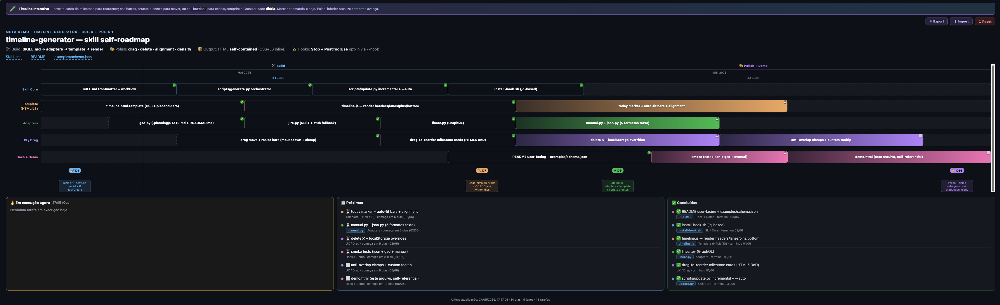

<div align="center">

# timeline-generator

**A living, drag-and-drop Gantt timeline as a single self-contained HTML — for Claude Code, Codex CLI, and OpenCode.**

Turn any task source — a GSD `.planning/` project, a Jira epic, a Linear project, a plain text list, or a JSON schema — into one interactive HTML file that updates as your work progresses.



```bash
npx skills add FelipeOFF/timeline-generator
```

**Works on Mac, Windows, and Linux. Requires Node 18+ and Python 3.9+.**

</div>

---

## What you get

- **One file, fully self-contained.** No build step, no server, no dependencies — open the HTML in any browser.
- **Daily granularity.** Bars snap by day; tooltip shows exact date, weekday, duration. A vertical golden line marks today.
- **Drag to refine.** Move bars, resize them, reorder milestone cards. Changes persist in `localStorage` with Import / Export / Reset buttons.
- **Source-agnostic.** Adapters normalize GSD, Jira, Linear, manual text, and raw JSON into one canonical schema.
- **Living document.** Optional Claude Code hooks regenerate the HTML when a phase completes or `.planning/STATE.md` changes — drag overrides survive the regen.
- **Status-aware bottom panel.** Three cards split the work into *Em execução agora* / *Próximas* / *Concluídas* based on today's date.

---

## Install

One command. The [`skills`](https://github.com/vercel-labs/skills) CLI auto-detects which agents you have installed (Claude Code, Codex CLI, OpenCode, Cursor, Windsurf, and 40+ others), prompts which to install into, and wires up the skill correctly for each runtime.

```bash
# Interactive — pick scope (project / global) and agents
npx skills add FelipeOFF/timeline-generator

# Install everywhere, skip prompts
npx skills add FelipeOFF/timeline-generator --all

# Global, only Claude Code
npx skills add FelipeOFF/timeline-generator -g -a claude-code

# Project-scope, Claude Code + Codex + OpenCode
npx skills add FelipeOFF/timeline-generator -a claude-code,codex,opencode -y
```

Useful follow-ups:

```bash
npx skills list                                 # show installed skills
npx skills update timeline-generator            # pull latest
npx skills remove timeline-generator            # uninstall
```

**Restart your agent after install** so the new skill is picked up.

---

## Getting started

Open Claude Code, Codex CLI, or OpenCode and run the skill as a slash command. The agent handles everything — adapter parsing, schema generation, file writes — you never touch Python directly.

### 1. Configure credentials (one-time, only if you use Jira or Linear)

```
/timeline-generator --config
```

The agent walks you through the prompts one at a time:

- Jira base URL (`https://yourcompany.atlassian.net`)
- Jira email
- Jira API token ([generate here](https://id.atlassian.com/manage-profile/security/api-tokens))
- Linear API key (`lin_api_…`, [generate here](https://linear.app/settings/api))

Skip any prompt to leave it blank. Answers are stored in `config.json` inside the skill folder (mode `0600`, gitignored). Nothing is ever committed.

### 2. Generate a timeline

```
# From a GSD project (auto-detects .planning/ in the current directory)
/timeline-generator

# From a Jira epic — children are discovered automatically
/timeline-generator https://x.atlassian.net/browse/PROJ-100

# From a Linear project or issue
/timeline-generator https://linear.app/team/project/abc

# From a plain text list of tasks
/timeline-generator tasks.txt --days 30 --title "Sprint 12"

# From a canonical JSON schema
/timeline-generator data.json
```

The agent writes `docs/timeline.html` by default and prints a `file://` link you can open in your browser.

### 3. Keep it alive (optional)

```
/timeline-generator --hook
```

Installs two Claude Code hooks that auto-update the HTML when work progresses — no manual regeneration needed. Drag overrides are preserved in `localStorage`.

---

## Commands

| Command | What it does |
|---------|-------------|
| `/timeline-generator` | Auto-detect source (GSD `.planning/` if present) and generate the HTML |
| `/timeline-generator <url-or-file>` | Generate from a Jira / Linear URL, a manual `.txt`, or a `.json` schema |
| `/timeline-generator --config` | Interactive credential setup — agent asks one question at a time |
| `/timeline-generator --update "<note>"` | Apply a progress note (`"PROJ-101 done"`, `"Phase 23 complete"`, `"PR #42 merged"`) |
| `/timeline-generator --hook` | Install Claude Code hooks for auto-update on phase completion or file edits |
| `/timeline-generator --hook --uninstall` | Remove installed hooks |
| `/timeline-generator --redesign` | Delegate the visual layer to the `ui-ux-pro-max` subagent for a one-off restyle |
| `/timeline-generator --regen` | Full regeneration ignoring previous output (browser drag overrides still survive) |
| `/timeline-generator --out <path>` | Override the default output path (`docs/timeline.html`) |
| `/timeline-generator --days <N>` | Force a specific timeline length in days |

All flags compose. Example: `/timeline-generator data.json --out public/roadmap.html --days 60`.

---

## Sources supported

| Source | Auto-detected? | Auth required? |
|--------|----------------|-----------------|
| GSD `.planning/` | Yes (when run from a project root) | No |
| Jira epic / issue URL | No — pass the URL | Yes (`/timeline-generator --config`) |
| Linear project / issue URL | No — pass the URL | Yes (`/timeline-generator --config`) |
| Plain text list (`.txt`) | No — pass the path | No |
| Canonical JSON schema (`.json`) | No — pass the path | No |

### Manual list format

One task per line. Tags work anywhere in the line:

```
- [x] Setup repo @dev #backend                # checklist + assignee + lane tag
- [ ] Build API #backend PROJ-101             # Jira key auto-linked
- [ ] Deploy staging *in-progress #devops     # explicit status tag
- [ ] Smoke tests !blocked #qa
- Docs #docs https://example.com              # URL becomes a link
```

Status tags: `~done`, `*in-progress`, `?in-review`, `!blocked`. Markdown checkboxes `[x]` / `[/]` also work. Lanes are inferred from `#hashtag` segments — the agent will ask you to confirm them before rendering.

### JSON schema

See `examples/schema.json` for the full shape. Minimum required:

```json
{
  "meta": { "title": "T", "base_date": "YYYY-MM-DD", "total_days": 30 },
  "lanes": [
    {
      "id": "l1", "label": "Lane", "color": "#38bdf8",
      "bars": [
        { "id": "t1", "label": "Task", "span": [1, 8], "status": "pending" }
      ]
    }
  ]
}
```

`span: [start, end_exclusive]` in day units (`1 ≤ start < end ≤ total_days + 1`). Within a single lane, bars **must not overlap** — parallel work belongs in separate lanes.

---

## Live HTML features

Every generated file ships with these built in — no configuration needed:

- **Today marker.** A vertical golden line auto-positions itself via `new Date()` on every page load.
- **Drag-to-move and drag-to-resize bars.** Day-snap, tooltip with date + weekday + duration.
- **Drag-to-reorder milestone cards.** Standard HTML5 drag-and-drop.
- **Bottom panel.** Three sections, recomputed live from today's date:
  - Em execução agora — `start ≤ today < end`
  - Próximas — sorted by start ascending
  - Concluídas — `status: done` or `end ≤ today`
- **Persistence.** Drag changes save to `localStorage` keyed by bar `id`.
- **Import / Export / Reset.** Buttons top-right of the timeline export overrides as JSON, reload from a file, or clear everything.

Regenerating the HTML does **not** wipe your drag overrides — they live in the browser.

---

## Hooks (auto-update)

```
/timeline-generator --hook
```

Installs two entries in your project's `.claude/settings.json`:

| Hook | Fires when | What it does |
|------|-----------|-------------|
| `Stop` | After an assistant turn finishes | Runs the updater idempotently |
| `PostToolUse` | After `Edit` / `Write` touches `.planning/STATE.md` | Regenerates only if mtime changed |

Use `--scope global` to install in `~/.claude/settings.json` instead. `--uninstall` removes both entries. Requires `jq` (`brew install jq`).

---

## Configuration

| Setting | Where it lives | Set via |
|---------|----------------|---------|
| `JIRA_BASE_URL` | `config.json` or env | `/timeline-generator --config` |
| `JIRA_EMAIL` | `config.json` or env | `/timeline-generator --config` |
| `JIRA_API_TOKEN` | `config.json` or env | `/timeline-generator --config` |
| `LINEAR_API_KEY` | `config.json` or env | `/timeline-generator --config` |

Resolution order: **env var → `config.json` → prompt the user**.

`config.json` lives inside the skill folder with mode `0600` and is gitignored. Tokens are masked when printed.

---

## How it works

The skill is a plain folder. Adapters parse each source into the canonical schema; the orchestrator fills an HTML template with that schema and writes the result. The LLM only drives the workflow — it never edits the template by hand.

```
timeline-generator/
├── SKILL.md           ← agent-facing instructions
├── README.md          ← this file
├── template/
│   ├── timeline.html.template
│   └── timeline.js    ← drag + today marker + import/export + bottom panel
├── scripts/
│   ├── generate.py    ← orchestrator (adapter → render → write)
│   ├── update.py      ← incremental patch + --auto detection
│   ├── config.py      ← credential management
│   └── install-hook.sh
├── adapters/
│   ├── gsd.py         ← .planning/STATE.md + ROADMAP.md → Schema
│   ├── jira.py        ← URL / epic key → Schema
│   ├── linear.py      ← URL / issue → Schema
│   ├── manual.py      ← text list → Schema
│   └── json.py        ← raw JSON pass-through
└── examples/
    └── schema.json    ← canonical data shape
```

You never call these scripts directly. The agent dispatches them based on the slash command.

---

## Limitations / known caveats

- Pin positions (interventions) only render at integer days — no fractional placement.
- Manual adapter does not yet read from stdin; pass a file path.
- Jira and Linear adapters group lanes by assignee. To group differently (by team, by component, by phase), generate a custom JSON schema and pass it instead.
- `--redesign` is a hand-off marker — the actual visual iteration is performed by the `ui-ux-pro-max` subagent, which must be installed in the host runtime.

---

## Requirements

- **Node 18+** — for `npx tiged` install only.
- **Python 3.9+** — runs the adapters and the renderer.
- **`jq`** — only needed if you install hooks (`brew install jq`, `apt install jq`, etc).

---

## License

MIT.
